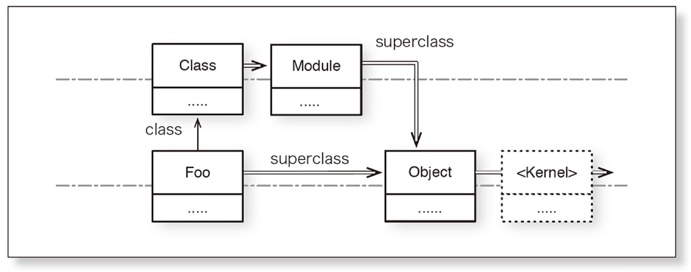

# 第7章 クラスの作成を理解する
〜ruby 3.0以降〜
<small style="color: red;">(旧バージョンでは紹介するコードは動かないことがあります)</small>
伊藤 淳一. プロを目指す人のためのRuby入門［改訂2版］　言語仕様からテスト駆動開発・デバッグ技法まで (Software Design plus) (Japanese Edition) Kindle 版.

# 参考資料

1. [プロを目指す人のためのRuby入門［改訂2版］　言語仕様からテスト駆動開発・デバッグ技法まで Software Design plus](https://www.amazon.co.jp/gp/product/B09MPX7SMY)
1. [[改訂2版]Ruby技術者認定試験合格教本(Silver/Gold対応) Ruby公式資格教科書](https://www.amazon.co.jp/dp/B0756VF9Y3)
1. [メタプログラミングRuby 第2版](https://www.amazon.co.jp/gp/product/4873117437)
1. [たのしいRuby 第6版](https://www.amazon.co.jp/gp/product/B07PNN3TYF)
1. [RubyExamination](https://rex.libertyfish.co.jp/)

# 最初に
> 知らないのは恥ではない、知ろうとしないのが恥である。
> 澤柳 政太郎

疑問に思ったことは、**声に出して**言い合いましょう!
なんなら、**マイクをオン**にしておいて思ったことをその場で言って下さいー。聞いてるだけだと、**寝ちゃいますよ!**
この時間を有意義にするかどうかは...**あなた次第です!**
なお、時間を意識せず作成しているため、タイムオーバーとなったら打ち切りで。

# 本日の知識のGoal
-  **Rubyの式**（変数、定数、メソッド呼び出し、if, while, クラス定義）**には戻り値がある**
- **インスタンス変数はオブジェクトが管理（保有）し、インスタンスメソッドはオブジェクトのクラスが管理（保有）する**
- Rubyは**オープンクラス**なので**既存のクラスに対してもオーバーライド（モンキーパンチ）**ができる。が、**「大いなる力には、大いなる責任が伴う」**


# 事前情報
説明の関係上、irb起動中に**rubyファイル書き換える**ことがあるため、require_relativeではなく**load**を使用します。以下はなんとなくの記載なので、詳しくは自分で調べてね。
| 条件 | require | require_relative | <span style="color: red; font-weight: bold;">load</span> |
| - | - | - | - |
| 実行 | 何度実行しても<br>**一度**しか実行しない | 同左 | **実行回数だけ<br>実行する** |
| 拡張子(.rbなど)省略 | 可(自動補完) | 同左 | 不可 |
| 相対パス | `./`記載必要<br>カレントディレクトリに<br>依存 | `./`記載不要 | `./`記載不要 |
| 特徴<br>使い所 | ライブラリインポート | 自作ファイルインポート | 設定情報読み込み<br>コードを実行<br>irbでのテスト<br>意図しない変数の変更 |

# レジュメ
| 章 | 内容 |
| -- | --- |
| 7.7 | メソッドの可視化 |
| 7.8 | 定数についてもっと詳しく |
| 7.9 | さまざまな種類の変数 |
| 7.10 | クラス定数やRubyの言語使用に関する高度な話題 |
| 7.11 | この章のまとめ |


## その前に、irbに入った時の空間に関して
- irbで **`self`** を打つと何が表示される？つまり、インスタンス名は？
- irbで **`self.class`** を打つと何が表示される？つまり、クラス名は？
- irbやファイルにいきなり、 **`def aisatsu; end`** を書くと何クラスのインスタンスメソッドになる？
※ `private_methods.include?(:aisatsu)`

<small>牧 俊男,小川 伸一郎. ［改訂2版］Ruby技術者認定試験合格教本（Silver/Gold対応）Ruby公式資格教科書 (Japanese Edition) (Kindle の位置No.2069). Kindle 版. </small>

# 7.7 メソッドの可視化
内部で使用し、外部には公開したくない、呼び出されると不具合等で可視性を制御したい、そもそも、外部で使用する必要がない。そんな時に...。

## インスタンスメソッドのpublic, private
- <span style="font-size: 28px; font-weight: bold; color: green;">public</span>
クラスの<u style="color: red;">外部に公開される</u>メソッド.
デフォルトでは、<u style="color: red;">initialize以外</u>

- <span style="font-size: 28px; font-weight: bold; color: orange;">protected</span>
そのメソッドを定義した<u style="color: red;">クラス自身と、そのサブクラスのインスタンスメソッドから</u>(レシーバ付き)で呼び出せるメソッド

- <span style="font-size: 28px; font-weight: bold; color: red;">private</span>
クラスの<u style="color: red;">外部に公開されない</u>メソッド(旧バージョンはレシーバ付では呼び出せなかった)

### 問題:インスタンスメソッドの可視性（public, private)
その前に<span style="color: red;">privateを含めてメソッドは継承される</span>(例：what_method)
`load "lib/add_method_to_object.rb"`

```ruby
def what_method(method)
  methods = %i[public protected private singleton]
  methods.each do |m|
    return m if send("#{m}_methods").include?(method)
  end
  return
end
```
※
```ruby
String.private_instance_methods.include?(:what_method)
String.private_methods.include?(:what_method)
```
`what_method`の紹介と継承チェーン(これは理解しなくてもOK)
全てのクラスはClassクラスのインスタンスなので、Classクラスのインスタンスメソッドは、他のクラスのクラスメソッドとなる。
<small>public記載して、再ロード</small>

<small>牧 俊男,小川 伸一郎. ［改訂2版］Ruby技術者認定試験合格教本（Silver/Gold対応）Ruby公式資格教科書 (Japanese Edition) (Kindle の位置No.2399). Kindle 版. </small>

`load "lib/user.rb"`
以下のメソッドを外部から呼び出すことはできますか？
1. User#greet
2. User#initialize
3. User#get_age

```ruby
class User
  def greet
    "私は、#{@name}です。よろしくお願いします。"
  end

  public
  def initialize(name:, age:, weight:)
    @name, @age, @weight = name, age, weight
  end

private
  def get_age
    @age
  end
end
```

### 可視性の変更方法

- 一緒に定義

```ruby
class User
  def foo = ‘hoge’ #=> :foo
  def bar = ‘bage’ #=> :bar

  private :foo, :bar
end
```

<small>endレスメソッド定義. (p.208). Kindle 版. </small>

- 一気に定義

```ruby
class User
  private def foo
    ‘hoge’
  end
end
```

<small style="color: red;">メソッド定義は式になっているので（=を使わないとしても）メソッド名をシンボルで返す(戻り値がある)</small>

> **Rubyの式には、変数と定数、さまざまなリテラル、それらの演算子式、ifや whileなどの制御構造、メソッド呼び出し(super・ブロック付き・yield)、 クラス／メソッドの定義**があります。
式は括弧によってグルーピングすることができます。
**式は評価されると値（評価値）が定まり、その値を返します**。ただし、return、break, next といったものは値を返しません。これらは評価された時点で制御が移ってしまいます。
空の式 () は nil を返します。
[Ruby3.1リファレンス](https://docs.ruby-lang.org/ja/latest/doc/spec=2fprogram.html#exp)

**if文も式である（戻り値の例）**
```ruby
if true
  judge = "正解"
else
  judge = "不正解"
end
puts judge

# ↓

judge = if true
  "大正解"
else
  "不正解"
end
puts judge
```

万葉課題での使用例：`lib/tasks_controller.rb`

### インスタンス変数のsetter, getterメソッドのおさらい(attr_accessor)
- メソッド定義

```ruby
class User
  def initialize(name)
    @name = name
  end

  def name = @name

  def name=(value)
    @name = value
  end
end
```

- 一気に定義(この一行で上記と同じメソッドが作成される)
<small>(変数を直接呼び出しているのではない)</small>

```ruby
class User
  attr_accessor :name #=> :name, :name=

  def initialize(name)
    @name = name
  end
end
```

**可視性を変更するときは**

- 一緒に定義

```ruby
class User
  attr_accessor :name #=> :name, :name=
  private :name, :name=

  def initialize(name)
    @name =name
  end
end
```

<small style="color: red;">attr_accessorも戻り値がある(式)</small>
- 一気に定義

```ruby
class User
  private attr_accessor :name

 def initialize(name)
    @name =name
  end
end
```

### インスタンスのprotectedメソッド
`load "lib/user.rb"`
**体重は他人に公開したくない!**
**でも、体重を他人と比較はしたい**

```ruby
class User
  def initialize(name, weight)
    @name, @weight = name, weight
  end

def heavier_than?(other)
    other.weight < @weight # X
  end
end
```
<small style="color: red;">weightメソッドを定義していないから呼び出せない!</small>
<small>コメントアウトを外して、再ロード</small>

```ruby
class User
  protected attr_reader :weight

  def initialize(name, weight)
    @name, @weight = name, weight
  end

  def heavier_than?(other)
    other.weight < @weight
  end
end
```

<small style="color: red;">外部からはUser#weightは呼び出せない。サブクラスの**インスタンス**をレシーバーとしてクラス内では呼び出せる</small>

## クラスメソッドのpublic, private
### 問題（classメソッドの可視)
`load "lib/user.rb"`
以下のメソッドを外部から呼び出すことはできますか？
1. User.counter_0
1. User.counter_1
1. User.counter_2

```ruby
class User
  @@count = 0
  def initialize(name:, age:, weight:)
    @name, @age, @weight = name, age, weight
    @@count += 1
  end

  def self.counter_0 = @@count
  private_class_method :counter_0

  class << self
    private
    def counter_1 = @@count
  end

  private
  def self.counter_2 = @@count
end
```

## モンキーパッチ
### 問題: 意図しないオーバーライド
- User#get_ageはprivateメソッドでした。Userを継承したAdmin#get_ageはprivate?
`load "lib/open_user.rb"`
```ruby
class User
  private
  def get_age = @age
end
```

```ruby
class OpenUser < User
  def get_age = "age: #{@age}"
end
```

- このコードに問題はありますか？
`load "lib/override.rb"`
`Array.name`
```ruby
class Array
  def self.name
    "Hash"
  end
end
```

**メソッド定義やモンキーパッチは、
祖先（継承元）やそのクラスのメソッドを把握した上で行いましょう**

## 今回のポイント
- <span style="font-size: 20px; color: red;">privateメソッドは継承される(つまり、呼び出せない言語(java等)もある!)</span>
- <span style="font-size: 20px; color: red;">クラスメソッドの可視化変更方法はインスタンスメソッドとは異なる(privateの下に定義してもprivateにはならない!)</span>
- <span style="font-size: 20px; color: red;">戻り値が何かを意識する(メソッド定義はメソッド名のシンボル、定数・変数代入はその値)。</span>
- <span style="font-size: 20px; color: red;">意図せぬオーバーライドに注意!</span>
- <span style="font-size: 20px; color: red;">ここで紹介したコードの一部は、ruby v3未満では動作しないことがある</span>

# 7.8. 定数

## 定数呼び出しと可視性
クラス外部から定数を参照するコード例(method作らなくていいんですね)

```ruby
クラス名::定数
```

<small>※ 注: 以下のシンボル記載とは異なるよ!</small>

```ruby
name: :desc
```

### 可視性
privateにしたい場合は、

```ruby
class Product
  DEFAULT_PRICE = 0　#=> 0
  private_constant :DEFAULT_PRICE
end
```
<small style="color: red;">定数定義も戻り値がある(式)</small>

## 定数とfreeze

### 問題: 定数とfreeze①

`load "lib/cash.rb"`
配列を定数で定義しつつ、その要素も同時に定数として定義できる

```ruby
class Cash
  MONEY = [JUYEN = 10, 50, 100, 500, 1000]
  @@var = 5
  def self.add_1 = @@var += 1
end
MONEY = [10, 50, 100, 500, 1000]
```

上記のコードがあるとして、以下のコードを実行するとどうなりますか？

```ruby
Cash::JUYEN
Cash::JUYEN = 5 #再代入
Cash.freeze
Cash::JUYEN = 10 #再代入
Cash::add_1
```

<small style="color: red;">注意: クラスをフリーズしたら、クラス変数までフリーズするやん！こんなことしちゃだめ！</small>
さて、

```ruby
MONEY
MONEY.__id__
MONEY = [1, 5, 10, 50, 100] # 再代入
MONEY.__id__
MONEY.map!(&:next) # nextは次のオブジェクトを返す(ex:1 -> 2)
MONEY.__id__
MONEY.freeze
MONEY = [10, 50, 100, 500, 1000]
MONEY.__id__
MONEY.freeze
MONEY.map!(&:next)
MONEY << 2000
MONEY += [2000]
MONEY.__id__
```

<small>注: nextメソッド(:next)に&をつけることでブロックにしている。<br>`&:next == {|m| m.next}`(mは別の記号でもok)</small>

```ruby
MONEY = [1, 5, 10, 50, 100] # 代入
MONEY = [10, 50, 100, 500, 1000]　# 代入
MONEY.map!(&:next) # 変更（破壊的:中身の代入）
MONEY << 2000 # 変更（破壊的:中身の代入）
MONEY += [2000] #=> MONEY = MONEY + [2000] 代入
```

### 定数とfreeze②:ミュータブルなオブジェクト

```ruby
MONEY_S = %w[10 50 100 500 1000].freeze
```

上記のコードがあるとして、以下のコードを実行するとどうなりますか？

```ruby
MONEY_S.map{|money| money << "00" } # 要素の破壊的変更
MONEY_S.map(&:freeze)
MONEY_S.map{|money| money << "00" } # 要素の破壊的変更
```

<small style="color: red;">ミュータブル（変更可能）なオブジェクト（配列やハッシュ、文字列）を要素までフリーズしたい時は大変。イミュータブル（変更不可能）なオブジェクト（数値、シンボル、真疑値）は破壊的変更ができないのでフリーズの必要はそもそもない。</small>

### 定数の参照
ファイルを実行すると何が出力されるでしょう？
`load "lib/rexical.rb", true`

```ruby
class C
  CONST = "C::CONST"
end

CONST = "Object::CONST"

class C1 < C
  CONST2 = "C1::CONST2"

  class C2
    CONST2 = "C2::CONST2"
    puts CONST
    puts CONST2
  end

  puts CONST
  puts CONST2
end

class C
  puts CONST
end
```
[定数参照の優先順位](https://docs.ruby-lang.org/ja/latest/doc/spec=2fvariables.html#prio)

## 今回のポイント
- <span style="font-size: 20px; color: red;">定数なのに再代入できちゃう!(警告付)</span>
- <span style="font-size: 20px; color: red;">メソッドの中で、定数定義、代入はできない(エラーになる)</span>
- <span style="font-size: 20px; color: red;">定数代入は戻り値がある</span>
- <span style="font-size: 20px; color: red;">定数探索(つまりクラス探索も)はメソッドや変数探索とは違う</span>
- <span style="font-size: 20px; color: red;">freezeはオブジェクトの破壊的変更を禁止(エラーになる)</span>
- <span style="font-size: 20px; color: red;">freezeはオブジェクトの要素に対する破壊的変更は止めない</span>
- <span style="font-size: 20px; color: red;">freezeは代入(参照変更)は止めない</span>

# 7.9 変数

## クラスインスタンス変数

インスタンス変数は、@から始まる変数です。
`load "lib/product_i.rb"`

```ruby
class Product
  @name = 'Product'

  def self.name = @name

  def initialize(name)
    @name = name
  end

  def name = @name
end

class DVD < Product
  @name = 'DVD'
  def upcase_name = @name.upcase
end
```

以下を実行するとどうなるでしょう?

```ruby
Product.name
DVD.name

product = Product.new("A great movie")
product.name

dvd = DVD.new("An awasome film")
dvd.upcase_name
```

- インスタンス変数はどこにあるのか？それは、<span style="color: red; font-weight: bold;">各オブジェクトが管理</span>しています。
- そして、クラスもまた、オブジェクトです。従って、クラスインスタンス変数は、そのクラスが管理しています。
- (クラス)インスタンス変数は継承されません。インスタンス変数がインスタンス（オブジェクト）毎に違うでしょ。
- インスタンス変数は、インスタンスメソッド内で定義されます。
- クラスインスタンス変数は、クラス構文直下又はクラスメソッド内で定義されます。
- 未定義のインスタンス変数を参照するとnil


### クラス変数

クラス変数は、@@から始まる変数です。
`load "lib/product_c.rb"`

```ruby
class Product
  @@name = 'Product'

  def self.name = @@name

  def initialize(name)
    @name = name
  end

  def name = @@name
end

class DVD < Product
  @@name = 'DVD'
  def upcase_name = @@name.upcase
end

def DVD.get_name
  @@name
end
```

以下を実行するとどうなるでしょう?

```ruby
Product.name
DVD.name

product = Product.new("A great movie")
product.name

dvd = DVD.new("An awasome film")
dvd.upcase_name

DVD.get_name
```
[クラス変数のスコープ](https://docs.ruby-lang.org/ja/latest/doc/spec=2fvariables.html#class_var_scope)

- クラス変数は、インスタンス、継承含め、共有される！
- クラス内部で定義される。
- クラスメソッドもインスタンスメソッドも扱える。
- 未定義のクラス変数を参照するとエラー！

### インスタンス、クラス変数まとめ
|項目| インスタンス変数 | クラスインスタンス変数 | クラス変数 |
|-|-|-|-|
|記号| @ | @ | @@ |
|管理| 各インスタンス | 各クラス | 定義されたクラス? |
|定義| インスタンスメソッド内 | クラス直下、<br>クラスメソッド内 | クラス内ならどこでも |
|値の継承| されない | されない | 共有 |
|未定義| nil | nil | エラー |
クラス変数が使われることはそれほど多くないそうです。
クラス変数の参照ルールも少し複雑ですが、通常はそれほど意識しなくて良いと思います。

## グローバル変数

グローバル変数は、$から始まる変数です。<span style="color: red; font-weight: bold;">クラスの内部、外部問わず</span>プログラムのどこからでも代入、参照が可能!
注意点:
- 未定義の参照はnil
- 理解しずらいプログラムを生むため、乱用禁止（基本使用しない）
- $で始まる変数には、「組み込み変数」、「特殊変数」として、すでに決められたものがある。（$&, $1, $stdin, $_など）


# 7.10 高度な話題

## エイリアスメソッドの定義
エイリアスメソッドの例(色々な言語の影響を受けているからですかね)
|代表的なクラス|メソッド名1|メソッド名2|
|-|-|-|
|String, Array etc| length | size |
|Enumerable| map | collect |
|Enumerable| inject | reduce |
他にもたくさん存在するよ。
名前が違いますが、どれも同じメソッドを呼び出しています。
それぞれ別々にメソッドを作っているわけではなく、
- aliasキーワードを使用して作成できます。(メソッドではなくキーワード)
- alias_methodメソッドというものもあります。（こちらはメソッド）

`load "lib/user.rb"`

```ruby
class User
  def initialize(name:, age:, weight:)
    @name, @age, @weight = name, age, weight
  end

  def name = @name

  def greet = "私は、#{@name}です。よろしくお願いします。"
end
```
`load "lib/add_alias_to_user.rb"`
```ruby
class User
  alias hello greet

  alias_method :original_name, :name
  def name = "Mr. #{original_name}"
end
```

##　メソッドを未定義と削除
- undef: メソッドを未定義にするキーワード。その名前のメソッドを呼び出せなくなる。メソッドとしてundef_methodもある。
- remove_method: メソッドを削除する。

`load "lib/user.rb"`
`load "lib/open_user.rb"`

```ruby
class User
  def initialize(name:, age:, weight:)
    @name, @age, @weight = name, age, weight
  end
  def greet = "私は、#{@name}です。よろしくお願いします。"
end

class OpenUser < User
  def greet = super + "#{@age}歳です!"
  # undef greet
  # remove_method :greet
end
```
<small style="color: red;">undef(キーワード)を使うと継承元の同名メソッドも呼び出せなくなる。一方、remove_methodを使えば継承元のメソッドは呼び出せる。</small>

### 今回のまとめ
- <span style="font-size: 20px; color: red;">別名つける時は、alias or alias_method。（引数が異なるから気をつけて）</span>
- <span style="font-size: 20px; color: red;">undef/undef_methodはメソッドを未定義に、remove_methodは削除（継承元を呼び出せるかの違い）</span>

## メソッドの再定義（オーバーライド）
`load "lib/juice.rb"`
ところで、以下を実行するとどうなるでしょう?
```ruby
x = 1
y = 1.0

x == y # 数値として等しいので、trueになります。
x.eql? y # 1.0はFloatクラスのオブジェクトなので、falseになります。
x.equal? y # 1.0は異なるオブジェクトIDを持つので、falseになります。
x.equal?(1) # 1はどこで参照しても同じオブジェクトIDなので、trueになります。
Integer === x # 右辺のオブジェクトが左辺のクラスのインスタンスならtrue.caseの比較に用いられたり、いろいろ再定義されてる。
```
さて、本題。
```ruby
class Juice
  attr_reader :name, :price
  def initialize(name:, price:)
    @name, @price = name, price
  end

  def self.coke
    Juice.new(name: :coke, price: 120)
  end
end
```
ジュースインスタンスをキーとしてハッシュで在庫を管理したい。
以下を実行したらどうなるでしょう?

```ruby
@juices = { Juice.coke => 5 }
coke = Juice.coke
@juices[coke] += 5
```

Hashのkeyは、**eql?メソッド**を使用して、そのkeyが同じオブジェクトか判断しています。そして、eql?は**hashメソッド**を用いて真疑値を返しています。

```ruby
"こんにちは".hash
"こんにちは".hash
"こんにちは".eql?("こんにちは")
Juice.coke.hash
Juice.coke.hash
Juice.coke.eql?(Juice.coke)
```

Hashのkeyにオブジェクトを使うには、eql?メソッドとhashメソッドを再定義すれば良い。→オープンクラスを使って再定義。
`load "lib/juice_refine.rb"`
```ruby
 class Juice
  def inspect = name

  def eql?(other)
    other.instance_of?(Juice) && name.eql?(other.name)
  end

  def hash = name.hash
end
```

```ruby
@juices = { Juice.coke => 5 }
coke = Juice.coke
@juices[coke] += 5
```

<span style="color: red;">注：メソッドの再定義ができないものがあります。</span>

```ruby
= ?: .. ... not && and || or ::
```

### 今回のまとめ
- <span style="font-size: 20px; color: red;">rubyはオープンクラスであり、メソッドをオーバーライドできる。</span>
- <span style="font-size: 20px; color: red;">不適切なオーバーライドはプログラム全体の動きをおかしくするので注意（どこにどう影響するか考えて行いましょう）。</span>
- <span style="font-size: 20px; color: red;">railsって結構モンキーパッチしてますよね</span>

## 特異メソッド
特定のオブジェクトにだけ紐付くメソッドを定義できる。
`直接コード打って`
```ruby
alice = "I am Alice"
bob = "I am Bob"

# インスタンスの特異メソッドの定義
def alice.shuffle = chars.shuffle.join
# class << alice
#   def shuffle = chars.shuffle.join
# end

alice.shuffle
bob.shuffle
```

```ruby
# クラスメソッドを定義する例
def String.shuffle(string) = string.chars.shuffle.join
# class << String
#   def String.shuffle(string) = string.char.shuffle.join
# end
```
クラスメソッドも特異メソッドの一種です。
以下の図が全てだー！疲れてきた...


## ダックタイピング
オブジェクトのクラスが何であろうとそのメソッドが呼び出せれば良しとするプログラミングスタイルのこと。Ruby, Python, JavaScript等のオブジェクト指向プログラミングの動的型付けのスタイル。
「もしもそれがアヒルのように歩き、アヒルのように鳴くのなら、それはアヒルである」

# 本日の知識のGoal
-  **Rubyの式**（変数、定数、メソッド呼び出し、if, while, クラス定義）**には戻り値がある**
- **インスタンス変数はオブジェクトが管理（保有）し、インスタンスメソッドはオブジェクトのクラスが管理（保有）する**
- Rubyは**オープンクラス**なので**既存のクラスに対してもオーバーライド（モンキーパンチ）**ができる。が、**「大いなる力には、大いなる責任が伴う」**
